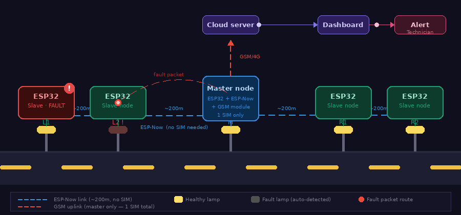

# CDDS — Centralized Defect Detection System for Street Lamps

<div align="center">


</div>

---

## System Architecture

<div align="center">



</div>

> Street lamps on both sides act as slave nodes. Data flows via **ESP-Now chain** (no SIM per lamp) toward the central master node, which uploads fault reports to the cloud via a **single GSM module**.

---

## The Problem

Street lamps in Indian cities and highways fail silently. Repairs only happen **after someone files a complaint** — and on highways and outskirts, complaints almost never come. A faulty lamp can stay broken for months, creating safety hazards and wasting energy.

There was no system to:
- Automatically detect that a lamp has failed
- Know **what** component failed (wire, driver, or LED panel)
- Know **where** the fault is (which lamp, which location)
- Send that information to authorities without human intervention

---

## The Solution

An automated fault detection system embedded inside every street lamp that:

1. Continuously monitors the lamp's electrical health using voltage sensors and an LDR
2. Identifies the exact fault type — input wire / LED driver / LED panel
3. Propagates fault data through a **chain mesh network** using ESP-Now (no SIM card per lamp)
4. Delivers the fault report to a cloud server via a **single GSM module** on the master node
5. Alerts the maintenance team automatically — no complaint needed

---

## Fault Detection Logic

Every slave node runs this cascade check:

| Check | Sensor | Result if failed |
|---|---|---|
| AC input voltage present? | ZMPT101B (AC voltage sensor) | **Input wire fault** |
| LED driver output voltage present? | DC voltage divider | **LED driver fault** |
| LDR brightness adequate? | LDR (Light Dependent Resistor) | **LED panel fault** |
| All checks pass | — | **Lamp healthy** |

```
if (AC_input ≈ 0V)              → fault = "Input wire"
else if (DC_output ≈ 0V)        → fault = "LED driver"
else if (LDR_value < threshold) → fault = "LED panel"
else                            → status = "OK"
```

---

## Why ESP-Now instead of GSM on every lamp?

| Approach | Cost per lamp | Monthly SIM cost (100 lamps) |
|---|---|---|
| GSM on every lamp | ₹800–1200 | ₹5,000–15,000 |
| **ESP-Now mesh + 1 GSM master** | **₹200–400** | **₹50–150 (one SIM)** |

ESP-Now is a peer-to-peer protocol built into every ESP32 chip. It works **without any router or internet**, reaches **~200 metres in open air**, and uses almost no power. Chaining lamps creates a mesh that covers an entire road — only the master node needs a SIM card.

---

## Node Roles

### Defect Detection Node (Slave)
Runs on every street lamp. Reads all sensors, identifies fault type, forwards data to next node.  
**Sensors:** ZMPT101B · DC voltage divider · LDR  
**Repo:** [Defect-Detection-For-Street-Lamp](https://github.com/RRaushan322/Defect-Detection-For-Street-Lamp)

### Initiator Node
First node in a road segment chain. Starts the data collection cycle.  
**Repo:** [Initiator-Street-Lamp](https://github.com/RRaushan322/Initiator-Street-Lamp)

### Mediator Node
Middle nodes in the chain. Receive data from previous node, append own status, forward to next.  
**Repo:** [Middiator_Lamp](https://github.com/RRaushan322/Middiator_Lamp)

### Responder Node
End nodes in the chain. Final relay before the master node.  
**Repo:** [Responder-Lamp](https://github.com/RRaushan322/Responder-Lamp)

### Sub-station / Master Node
Central node for a road segment. Has a GSM module. Collects all fault data and sends to cloud.  
**Repo:** [Substation-For-Street-Lamp](https://github.com/RRaushan322/Substation-For-Steet-Lamp)

---

## Tech Stack

| Layer | Technology |
|---|---|
| Microcontroller | ESP32 (Espressif) |
| Wireless protocol | ESP-Now (peer-to-peer, ~200m range) |
| Cellular uplink | GSM module (SIM800L or similar) |
| AC sensing | ZMPT101B voltage transformer module |
| DC sensing | Resistor voltage divider |
| Light sensing | LDR (Light Dependent Resistor) |
| Firmware language | C++ (Arduino framework) |

---

## Repository Index

| Repository | Role |
|---|---|
| [CDDS (this repo)](https://github.com/RRaushan322/CDDS) | Project overview and documentation |
| [Defect-Detection-For-Street-Lamp](https://github.com/RRaushan322/Defect-Detection-For-Street-Lamp) | Slave node — sensor reading + fault detection |
| [Initiator-Street-Lamp](https://github.com/RRaushan322/Initiator-Street-Lamp) | Chain start node |
| [Middiator_Lamp](https://github.com/RRaushan322/Middiator_Lamp) | Chain relay node |
| [Responder-Lamp](https://github.com/RRaushan322/Responder-Lamp) | Chain end node |
| [Substation-For-Street-Lamp](https://github.com/RRaushan322/Substation-For-Steet-Lamp) | Master node — GSM + cloud uplink |

---

## Problem Statement Details

| Field | Value |
|---|---|
| Problem Statement | Centralized Monitoring System for Street Light Fault Detection and Location Tracking |
| PS Number | 1512 |
| Organization | Ministry of Housing and Urban Affairs |
| Category | Hardware |
| Domain | Smart Automation |

---

<div align="center">
Made for Smart India Hackathon &nbsp;·&nbsp; PS 1512 &nbsp;·&nbsp; Ministry of Housing and Urban Affairs
</div>
